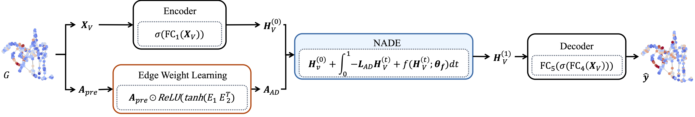

# Climate Modeling with Neural Advection-Diffusion Equation

[](https://hits.seeyoufarm.com)
 
[](https://paperswithcode.com/sota/weather-forecasting-on-la?p=climate-modeling-with-neural-advection)  [](https://paperswithcode.com/sota/weather-forecasting-on-sd?p=climate-modeling-with-neural-advection)  [](https://paperswithcode.com/sota/weather-forecasting-on-noaa-atmospheric?p=climate-modeling-with-neural-advection)

This repository contains the implementation of NADE (Neural Advection-Diffusion Equation), a novel deep learning approach for climate modeling as described in our paper "[Climate Modeling with Neural Advection-Diffusion Equation](https://github.com/hwangyong753/NADE)".

## Overview

NADE combines the advection-diffusion equation with neural networks to model climate systems. Key features include:

- Edge weight learning to model diffusion coefficients and flow velocities
- Neural network-based uncertainty modeling
- Integration with the advection-diffusion equation


## Usage
To run the model:
```
$ cd model
$ python Run.py --dataset DATASET_NAME --mode MODE --device DEVICE
```
where:
- `DATASET_NAME` can be 'LA', 'SD', or 'NOAA'
- `MODE` can be 'train' or 'test'
- `DEVICE` can be 'cuda' or 'cpu'

Example:
```
python Run.py --dataset NOAA --mode train --device cuda
```

## Datasets
We provide experiments on real-world datasets:
- Los Angeles (LA) and San Diego (SD) climate data
- NOAA temperature data

Each dataset has its own configuration file (e.g., `LA.conf`, `SD.conf`, `NOAA.conf`) in `model` directory.

## Citation
If you use this code in your research, please cite our paper:
```
@article{choi2023climate,
title={Climate modeling with neural advection--diffusion equation},
author={Choi, Hwangyong and Choi, Jeongwhan and Hwang, Jeehyun and Lee, Kookjin and Lee, Dongeun and Park, Noseong},
journal={Knowledge and Information Systems},
volume={65},
number={6},
pages={2403--2427},
year={2023},
publisher={Springer}
}```